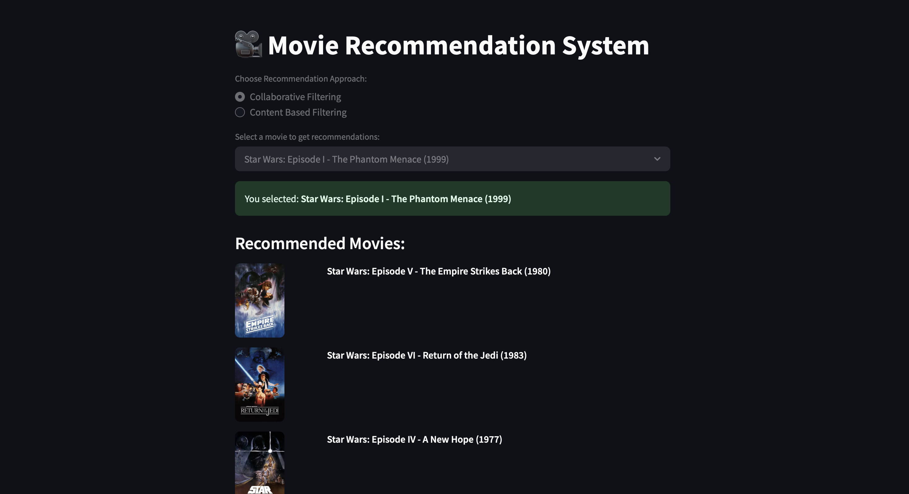

# 🎬 Movie Recommendation System

A smart and interactive movie recommendation system that suggests movies based on user preferences using **Content-Based Filtering** and **Collaborative Filtering** techniques. It also includes a simple GUI interface built with Tkinter for user interaction.

---

## 📌 Table of Contents

- [Introduction](#introduction)
- [Tech Stack](#tech-stack)
- [Recommendation Approaches](#recommendation-approaches)
  - [Content-Based Filtering](#1-content-based-filtering)
  - [Collaborative Filtering](#2-collaborative-filtering)
- [How to Run](#how-to-run)
- [Interface Demo](#interface-demo)
- [Project Structure](#project-structure)
- [Future Work](#future-work)
- [License](#license)

---

## 🧠 Introduction

This project is a hybrid movie recommendation system built with Python. It leverages machine learning techniques to recommend movies to users by analyzing either movie metadata or collaborative viewing patterns. The system includes:

- Content-Based Filtering: Recommends movies similar in genre, keywords, cast, etc.
- Collaborative Filtering: Suggests movies based on the ratings of similar users.
- A simple GUI interface for user-friendly interaction.

---

## 🛠️ Tech Stack

- **Python 3.x**
- **Pandas**, **NumPy**, **scikit-learn**
- **Surprise** (for collaborative filtering)
- **Tkinter** (for GUI)
- **Jupyter Notebooks** (for development and prototyping)

---

## 🔍 Recommendation Approaches

### 1. Content-Based Filtering

- Utilizes metadata like **genre**, **director**, **cast**, and **keywords**.
- Cosine similarity is calculated between movie vectors created from combined features.
- Suggests similar movies to the one a user likes.

> Implemented in: `/Content based`

### 2. Collaborative Filtering

- Based on user-item interactions.
- Matrix factorization using the **SVD algorithm** from the `Surprise` library.
- Recommends movies based on similar users' preferences.

> Implemented in: `/Colaborative Filtering`

---

## ▶️ How to Run

### 1. Clone the repository

```bash
git clone https://github.com/NandanPaT-eL/Movie-Recommendation-System.git
cd Movie-Recommendation-System
```

### 2. Install dependencies

```bash
pip install -r requirements.txt
```

### 3. Run the Streamlit file

```bash
cd interface
python main.py
```

## Interface Demo


